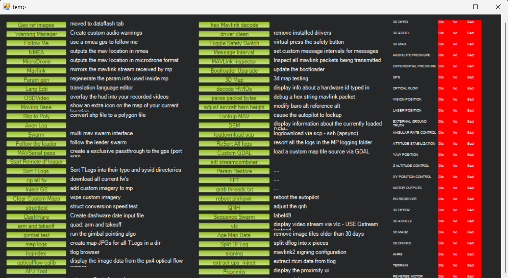
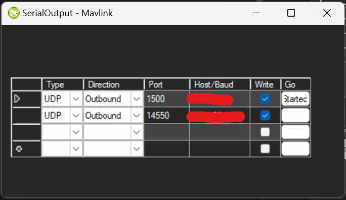

# Receive Simulated Flight Data on Raspberry Pi

The following steps can be followed to run a simulated drone session in Mission Planner and then get data from the simulated flight controller on a Raspberry Pi.


1. Open Mission Planner software on your computer (non Raspberry Pi).
2. Hit Ctrl+F in Mission Planner. You should see a "temp" tab pop up (like the one below)


<br>

3. Click the "Mavlink" button. You should see a SerialOutput tab like the one shown below pop up.


4. On one line of the SerialOutput tab, select "UDP" as the Type, "Outbound" as the Direction, and 14550 as the "Port" your Raspberry Pi IP address as the Host. Also check the "Write" box. Then, hit the Go button. This should allow you to now listen for data on port 14550 on your Raspberry Pi.
    - You will have to hit the Go button every time you restart Mission Planner and want to get data from your simulated flight on your Raspberry Pi.


5. Start a simulated flight in Mission Planner. Go to the "Simulation" tab, click "quad" as the Model, and then hit the "Multirotor" icon to start the simulation. 
    
6. Run the following script on your Raspberry Pi to confirm that you can receive data from the simulated flight:
    ```
    from pymavlink import mavutil

    master = mavutil.mavlink_connection('udp:0.0.0.0:14550')

    master.wait_heartbeat()
    print("Got heartbeat!")
    ```

    - You should see the line "Got heartbeat!" printed out if everything is successful. This means that you can now set up simulated missions in Mission Planner and then run scripts on your Raspberry Pi to get different data points from the flight controller.